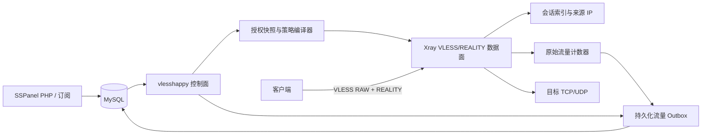

# 02. 总体架构

## 1. 系统关系



## 2. 进程模型

首版一个 `vlesshappy` 进程只服务一个 `node_id`：

- 单个 TCP 监听端口；
- 多个真实面板用户；
- 一个 REALITY 节点密钥；
- 一个 MySQL 数据源；
- 一个本地状态目录；
- 一个内部会话注册表；
- 不暴露公网管理 API。

VLESS `email` 必须使用稳定、不可包含用户邮箱的内部标识：

```text
sspanel-node-<node_id>-user-<user_id>
```

该标识用于统计与内部关联，日志默认只记录 `node_id/user_id`，不记录用户真实邮箱、UUID 或 REALITY 材料。

## 3. 核心组件

### 3.1 Config Loader

- 从命令行指定的配置文件读取非秘密配置。
- 从单独 secret 文件读取 REALITY 私钥和数据库密码。
- 拒绝未知字段、重复字段、无效单位、越界数值和相对 secret 路径。
- 提供 `validate` 子命令，只校验，不启动监听器。

### 3.2 Database Adapter

- 读取节点、VLESS 节点扩展配置和可用用户。
- 使用短事务写入用户流量、原始日志、节点带宽和批次幂等表。
- 独立写入 alive IP、在线数、节点信息和心跳。
- 数据库连接池默认 `max_open=4`、`max_idle=2`，所有操作带 context deadline。

### 3.3 Authorization Compiler

把数据库记录编译为不可变快照：

- UUID 到 `user_id` 的唯一映射；
- 用户额度、等级、分组、限速、连接上限；
- forbidden IP/CIDR、forbidden port/range、disconnect IP；
- 节点是否可用及节点带宽状态；
- 快照版本、数据库读取时间和内容哈希。

单个用户的 UUID、IP/CIDR 或端口规则非法时，只隔离该用户并输出脱敏告警；不得因此继续为该用户使用旧策略。节点级配置非法时，整个新快照拒绝发布。

### 3.4 Xray Adapter

- 构造一个 VLESS 入站，使用 RAW/TCP、REALITY、Vision。
- 原子应用用户差异。
- 为连接建立 `user_id/source_ip/session_id` 关联。
- 在授权变化时终止指定用户全部会话。
- 在域名解析完成后，将最终 IP 再交给策略检查器。
- 暴露进程内流量增量，不依赖不可靠的日志解析。

### 3.5 Session Registry

会话注册表至少记录：

- 用户 ID；
- 会话 ID 和类型：TCP、Mux、XUDP；
- 归一化后的来源 IPv4/IPv6；
- 创建时间、最后活动时间；
- 当前撤销 generation；
- 可取消 context。

同一来源 IP 的多个会话在 alive IP 上报中去重。用户快照 generation 变化时，旧 generation 会话必须重新检查或关闭。

### 3.6 Accounting Pipeline

- 在代理边界统计原始 `uplink/downlink`。
- 每个周期交换成不可变批次。
- 先原子写入本地 outbox，再尝试数据库事务。
- 数据库提交后才删除/确认本地批次。
- 崩溃后按批次 ID 重放，数据库重复批次只确认、不重复更新。

### 3.7 Telemetry

最低指标：

- 当前状态和授权快照年龄；
- TCP、Mux、XUDP 会话数及拒绝原因；
- 每用户/全局限制触发数；
- 待入账批次数和字节；
- 数据库延迟、错误、最后成功时间；
- RSS、Go heap、goroutine、FD、CPU；
- 节点在线用户和活跃 IP 数；
- 被策略拦截的目标类别，不记录完整敏感目标。

## 4. 生命周期状态机

```text
BOOTSTRAP -> SYNCING -> SERVING -> DEGRADED_AUTH
     |          |          |             |
     +----------+----------+-------------+-> DRAINING -> STOPPED
```

- `BOOTSTRAP`：校验配置、secret、状态目录和 outbox；不监听。
- `SYNCING`：必须成功取得第一份完整授权快照；失败则继续重试但不监听。
- `SERVING`：正常接收新会话。
- `DEGRADED_AUTH`：数据库不可用但授权快照仍在 3600 秒范围内；继续按旧快照服务，流量必须可安全落入 outbox。
- 快照超过 3600 秒、outbox 无法持久化或达到硬上限：停止接收新会话并进入受控 drain。
- `DRAINING`：关闭监听器，取消被撤销会话，结算流量，等待存量会话或 120 秒上限。
- `STOPPED`：所有未入账流量已经安全落盘，进程退出。

## 5. 规划目录

```text
vlesshappy/
├── README.md
├── docs/
├── cmd/vlesshappy/
├── internal/
│   ├── accounting/
│   ├── authz/
│   ├── config/
│   ├── database/
│   ├── lifecycle/
│   ├── policy/
│   ├── session/
│   ├── telemetry/
│   └── xrayadapter/
├── core/                     # 固定上游 Xray-core 与最小 hook patch
├── migrations/
├── panel-overlay/            # 父项目相对路径的面板集成材料
├── testdata/
├── integration/
├── packaging/
├── Dockerfile
├── go.mod
└── THIRD_PARTY_NOTICES.md
```

实现中可以细化内部包，但不得把业务代码、生成物或测试状态写到 `vlesshappy/` 之外。
